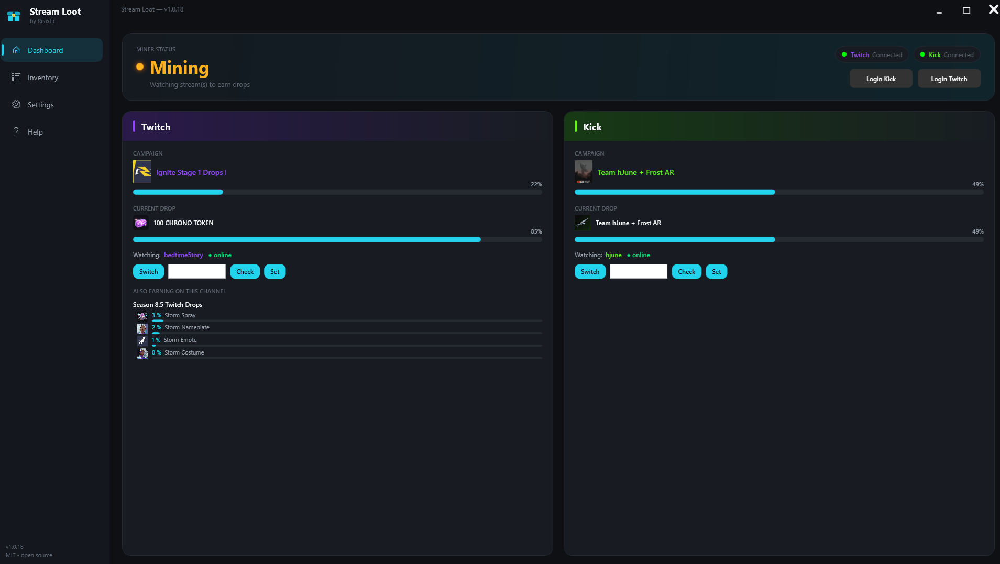
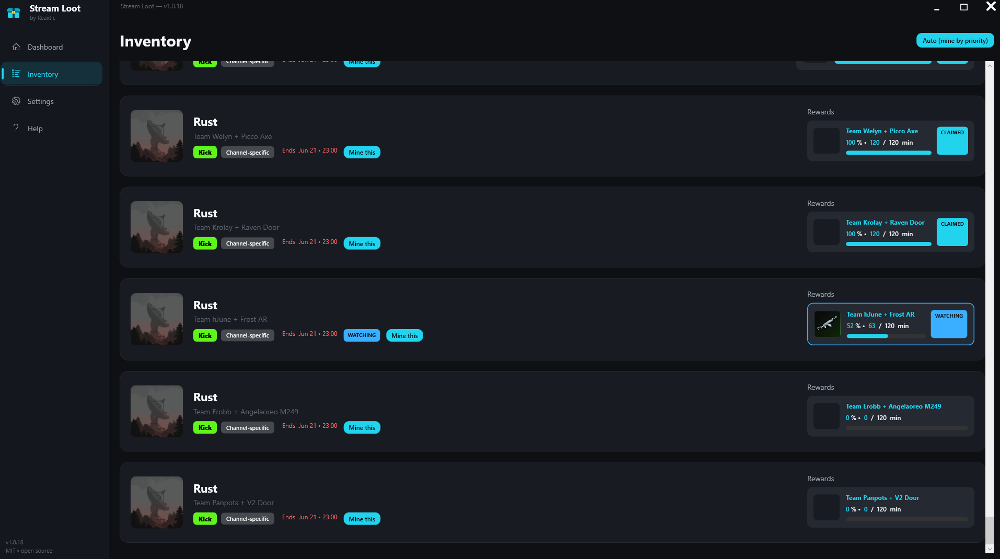
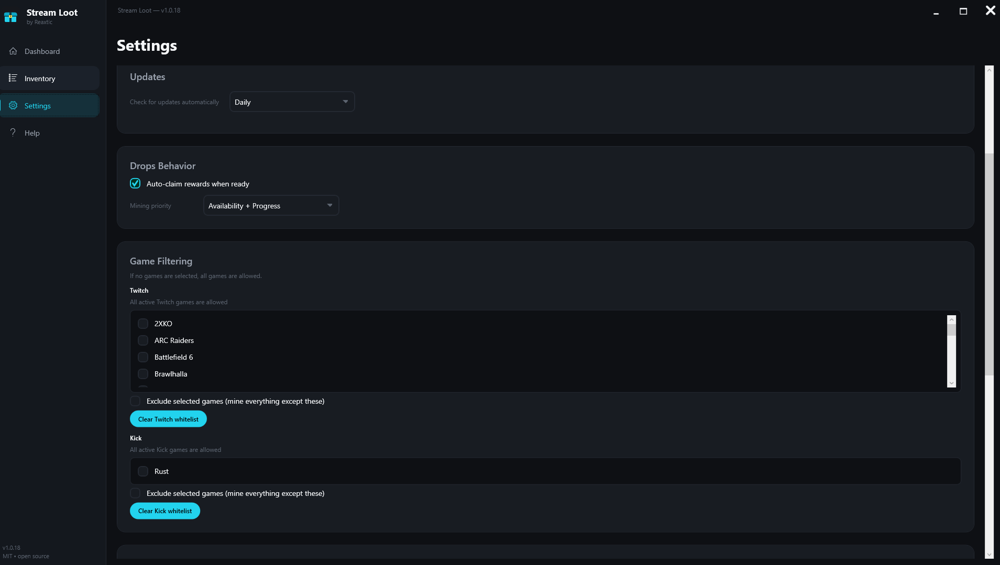

<div align="center">


# Stream Loot

**Set‑and‑forget drops miner for Twitch & Kick.**
Stream Loot watches the right streams in the background, tracks every active drop campaign in real time, and claims your rewards automatically — on **both platforms at once**.

[](LICENSE)
[](https://dotnet.microsoft.com/download)
[](#requirements)
[](https://github.com/Reaxtic/StreamLoot/stargazers)

> Fork of [**Stream Drop Collector** by Marcus Jensen (tsgsOFFICIAL)](https://github.com/tsgsOFFICIAL/StreamDropCollector), used under the MIT License — heavily reworked for performance, reliability, multi‑campaign tracking and a redesigned UI. See [LICENSE](LICENSE).

</div>

---

## ✨ Why Stream Loot?

- 🎮 **Twitch _and_ Kick at the same time** — mine drops on both platforms simultaneously, fully automatic.
- 🧠 **Smart selection** — automatically picks the best campaign + a live participating streamer, including general/category drops.
- 🪙 **Auto‑claim** — finished rewards are claimed within seconds, not on a slow timer.
- 👀 **See everything you earn** — live progress bars per campaign **and** per drop, plus an **"Also earning on this channel"** list that shows every other campaign filling up at the same time.
- 🎯 **Manual control when you want it** — pin a campaign with **Mine this**, **switch streamer**, or set a **specific channel** (with a built‑in live/eligibility check).
- 🟢 **Live status** — see at a glance whether the watched streamer is online, and which campaign is general vs. channel‑specific.
- 🧹 **Game filter** — allow‑list **or** exclude‑list specific games, per platform.
- 🪶 **Lightweight & quiet** — forces lowest stream quality, handles mature‑content gates, runs happily in the background or system tray.
- 🎨 **Modern UI** — clean dark theme, cyan accent, rounded cards, responsive layout.

---

## 📸 Screenshots

| Dashboard | Inventory |
|---|---|
|  |  |

| Settings |
|---|
|  |

---

## 🚀 Quick start

1. **Download** the latest release from the [**Releases**](https://github.com/Reaxtic/StreamLoot/releases/latest) page.
2. **Extract** the ZIP anywhere.
3. Run **`Stream Loot.exe`**.
4. Click **Login Twitch** / **Login Kick** and sign in inside the embedded browser windows.
5. That's it — Stream Loot starts mining and claiming automatically. 🎉

> Self‑contained build — no .NET install required.

---

## 🧩 How it works

Stream Loot uses an embedded **WebView2** browser (the same engine as Edge) to log you in and read Twitch's GraphQL API + Kick's drops API directly:

1. Fetches your active drop campaigns from both platforms.
2. Picks the highest‑priority campaign and a **live** streamer that actually participates in it.
3. Watches at the lowest quality in the background. Because one stream credits **every** eligible campaign for that game, the dashboard shows all of them progressing together.
4. Reconciles real progress with the servers periodically and **claims** rewards the moment they're complete.

Twitch and Kick are handled **independently** — finishing or switching on one platform never disrupts the other.

---

## 🛠️ Build from source

Requires the [**.NET 10 SDK**](https://dotnet.microsoft.com/download) (Windows desktop workload).

```bash
git clone https://github.com/Reaxtic/StreamLoot.git
cd StreamLoot
dotnet publish UI/UI.csproj -c Release -r win-x64 --self-contained true
```

Output: `UI/bin/Release/net10.0-windows10.0.17763.0/win-x64/publish/` → run `Stream Loot.exe`.

---

## 🔒 Privacy & safety

- Logins happen **only** inside the embedded WebView2 browser — same as logging in via Edge/Chrome.
- Your credentials and session **never leave your machine** and are never sent to any third party.
- Network traffic goes **only** to Twitch.tv and Kick.com.
- All settings, logs and cache live locally in `%APPDATA%\Stream Loot`.

> Sharing the app folder? Delete the `Stream Loot.exe.WebView2` folder first — it holds **your** login session.

---

## ⚙️ Requirements

- Windows 10 / 11 (64‑bit)
- A Twitch and/or Kick account

---

## ⚠️ Disclaimer

Stream Loot is provided for **personal use** and for educational purposes. Automated viewing may conflict with the Terms of Service of Twitch and/or Kick — **use it at your own risk**. This project is **not affiliated with, endorsed by, or sponsored by** Twitch, Kick, or any game publisher. All trademarks and reward artwork belong to their respective owners.

---

## 🤝 Contributing

Issues and pull requests are welcome — bug reports, ideas, and improvements all help.

---

## 📜 License & credits

Released under the [**MIT License**](LICENSE).

Stream Loot is a fork of **Stream Drop Collector** by **Marcus Jensen (tsgsOFFICIAL)** — full credit to the original author. Modifications © Reaxtic.

**Acknowledgment:** the drop‑crediting approach (Twitch "minute‑watched" events) and the live channel‑picker UX were inspired by [**TwitchDropsMiner** by DevilXD](https://github.com/DevilXD/TwitchDropsMiner) (also MIT‑licensed). No source code was copied — Stream Loot is an independent C#/.NET implementation — but the protocol insight and UX ideas deserve a thank‑you.

See the full release history in [CHANGELOG.md](CHANGELOG.md).

<div align="center">

⭐ **If Stream Loot saves you hours of idle watching, drop a star — it genuinely helps!** ⭐

</div>
